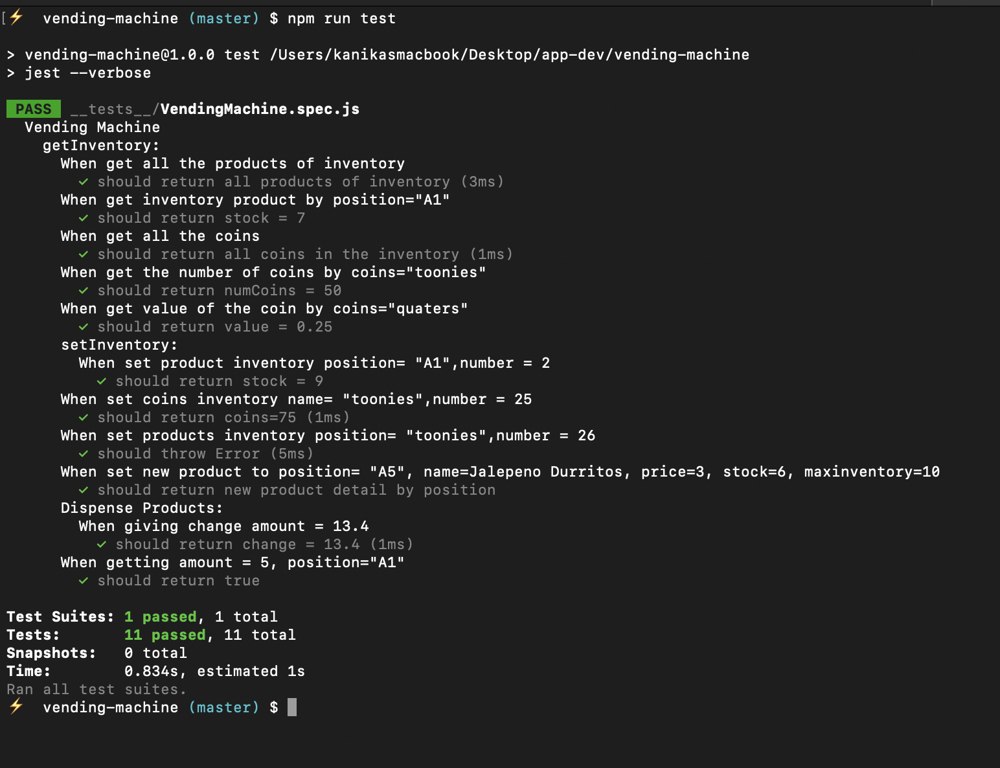

# Vending Machine

It demonstrates learnings in test-driven development through tests and functions for an imaginary vending machine.
Vending machine and its tests, coded in one Javascript class with no interface, that basically has the following functionality:

- Print inventory
- Refill inventory
- Re-supply change
- Dispense inventory based on payment
- Return change as coins (eg. \$0.25 is 1 quarter and 1 dime)

## Technologies

- JavaScript
- Node
- Jest

## Screenshot



## Installation

Download the repo, then in its folder run:

```
npm install

```

## Run Command

```
npm run test

```

Optionally run one particular test suite using the name a file in the tests folder:

```
jest

```
